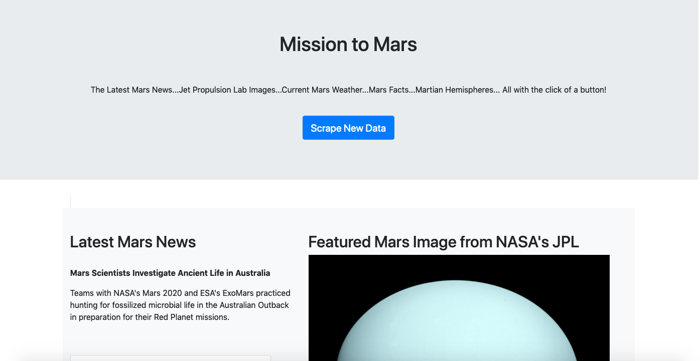
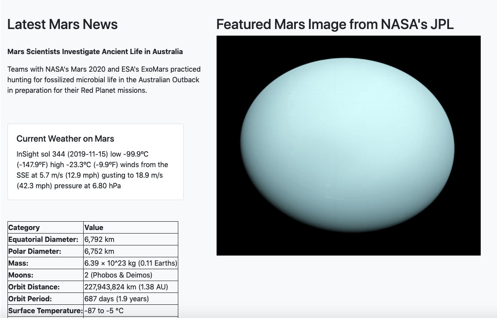
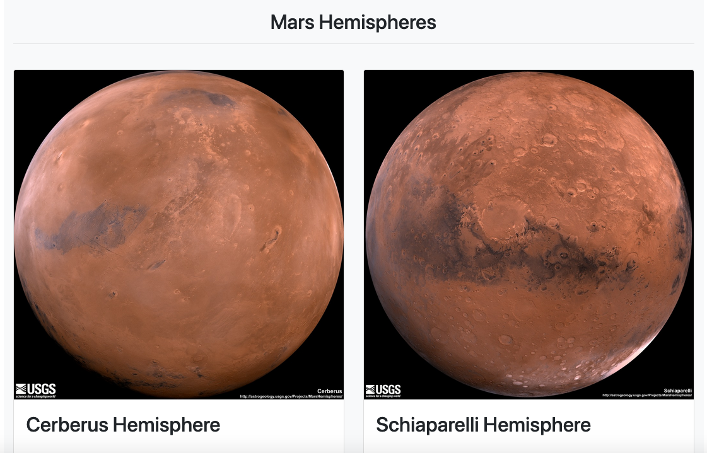
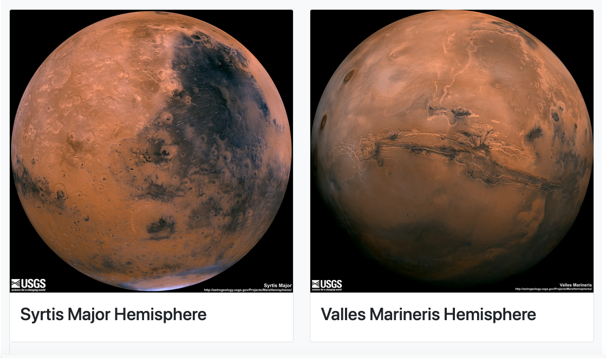

# Mission to Mars

For this project, I created a dashboard with Mars information using BeautifulSoup & Splinter to scrape Mars websites. The dashboard includes a button that updates the information when clicked. 
   
 
 ## Site Features
 
 

